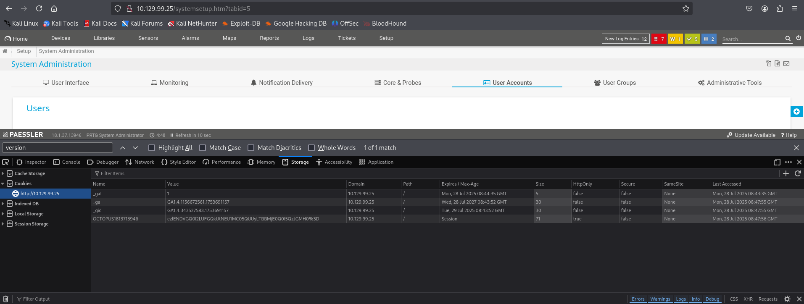

# Netmon - Walkthrough

## 🧗 Initial Foothold

### 🌐 1. PRTG Network Monitor Web Interface
- Accessed the PRTG interface in browser at default location.
- Noticed **port 21 (FTP)** is open.

### 🔍 2. FTP Access and Config File
- Looked through FTP for configuration files:
  ```
  ProgramData/Paessler/"PRTG Network Monitor"/PRTG Configuration.old.bak
  ```
- Found credential strings inside the `.bak` file.

### 🔐 3. Login Attempts
- Tried the recovered credentials on the web UI.
- Login failed initially.
- Realized the password format likely changes **by year**.
- Adjusted the password by updating the year → Login succeeded.

---

## ⚙️ Privilege Escalation

### 💣 1. Exploit PRTG Cookie Injection (ExploitDB 46527)
- Used the following public exploit:
  [46527.sh](https://www.exploit-db.com/exploits/46527)

- Opened Developer Tools with:
  ```
  Ctrl + Shift + I → Storage tab
  ```



- Copied the session cookies listed under the domain `10.129.99.25`.

### 🧪 2. Run the Exploit
- Used this command structure:
  ```bash
  ./exploit.sh -u http://10.129.99.25 -c "_ga=GA1.4.1156672561.1753691157; _gid=GA1.4.343527583.1753691157; OCTOPUS1813713946=ezlENDVGQ0I2LUFGQkUtNEU1MC05QUUyLTBBMjE0Q0I5QzJGMH0%3D; _gat=1"
  ```

### 🖥️ 3. Remote Shell Access
- After successful exploitation, used `evil-winrm` to gain shell access as Administrator.

---

## 🧠 Notes

- Always check open FTP ports for old config files.
- If a password doesn’t work — try modifying date values.
- Exploiting sessions via cookies is effective when persistent login tokens are stored insecurely.
